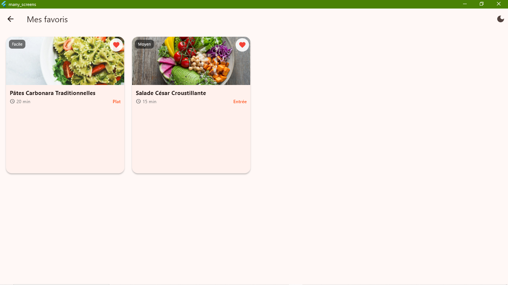
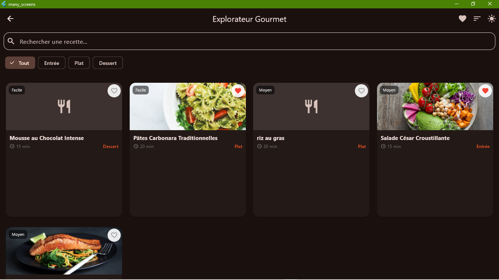
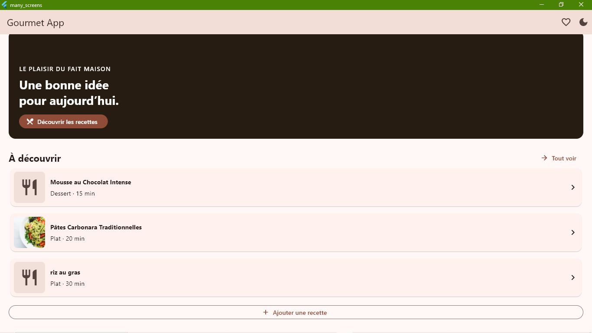
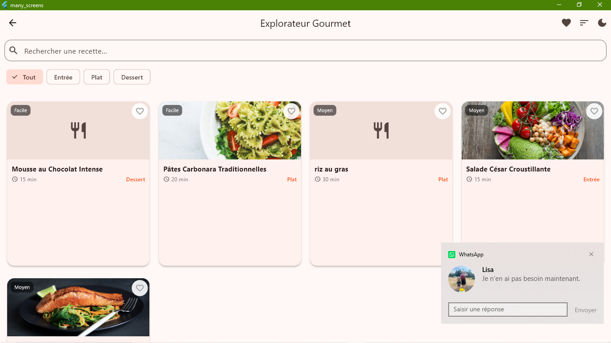
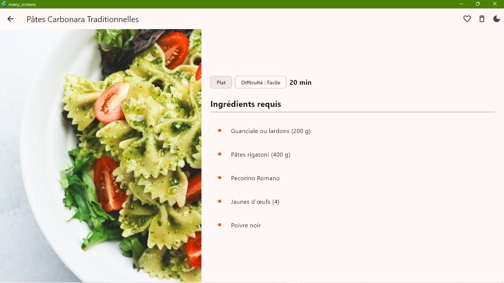

# Gourmet App — application Flutter multi-écrans

Application de recettes réalisée pour le projet de certification Flutter. Elle présente une navigation multi-écrans, une recherche avec filtre par catégorie, des détails accessibles par identifiant, la gestion des favoris et un formulaire de création validé.

## Fonctionnalités

- Accueil, liste des recettes, détails, ajout d’une recette et favoris.
- Navigation déclarative avec GoRouter et routes nommées.
- Recherche sur les noms et ingrédients, plus filtre par catégorie.
- Écran détail identifié par paramètre d’URL (`/details/:id`).
- Formulaire validé : nom, durée en minutes, catégorie, difficulté et ingrédients. Les créations et suppressions sont enregistrées.
- Ajout, affichage trié (nom ou durée), recherche, favoris et suppression des recettes.
- Persistance locale JSON via SharedPreferences : les recettes et favoris survivent au redémarrage.
- Mise en page adaptative : grille selon la largeur disponible et détail en deux colonnes sur tablette.
- Widgets réutilisables sous `lib/widgets/` : bouton, barre de recherche, carte, mise en page responsive, image de recette et contrôle de thème.
- Images distantes avec visuel de remplacement si l’image n’est pas disponible.

> Le stockage JSON est local à l’appareil : il n’y a pas de synchronisation entre appareils ou de compte utilisateur.

## Prérequis et lancement

Installer Flutter et vérifier l’installation :

```sh
flutter doctor
```

Depuis la racine du dépôt :

```sh
flutter pub get
flutter run
```

Pour choisir une cible, lister les appareils avec `flutter devices`, puis lancer par exemple :

```sh
flutter run -d chrome
```

## Vérifications

```sh
flutter analyze
flutter test
```

Les 16 tests couvrent la navigation, le filtrage, la route détail, le formulaire et le thème, ainsi que le `RecipeManager` (tri, validation métier, favoris, suppression, exceptions), le repository JSON (sauvegarde/restauration et données corrompues) et un faux repository en mémoire pour l’isolation.

## Démo web GitHub Pages

La version web de l’application est accessible ici :

https://Mariano-Espoir.github.io/gourmets_many_screens/

Pour générer la build web locale :

```sh
flutter build web
```

Pour publier la version web sur GitHub Pages, la branche `gh-pages` doit contenir le contenu du dossier `build/web`.

## Structure principale

```text
lib/
  data/       gestionnaire métier, repository JSON, exceptions et données de départ
  models/     modèle Recipe et sérialisation JSON
  routes/     configuration GoRouter
  screens/    accueil, liste, détails, formulaire, favoris
  theme/      thèmes clair et sombre
  widgets/    composants réutilisables et responsive
test/         tests widget et tests unitaires avec faux repository
```

## Captures d’écran

### Accueil



### Liste des recettes en thème clair



### Liste des recettes en thème sombre



### Détail d’une recette



### Favoris



## Publication

Pour publier le projet, créer un dépôt GitHub public, ajouter le dépôt distant, puis pousser la branche principale. Ne pas inclure les clés ou fichiers de configuration contenant des secrets.
